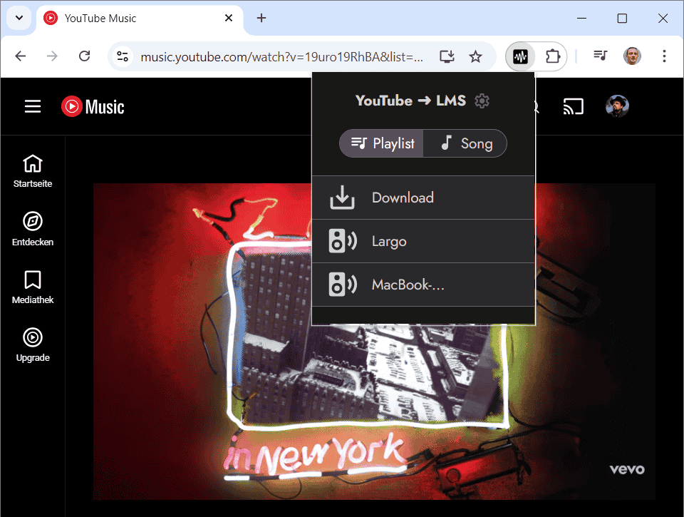
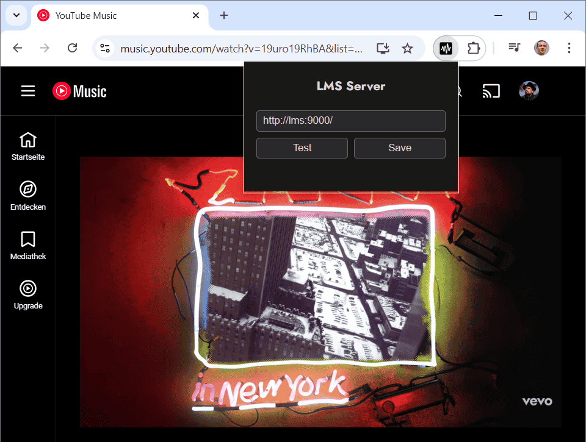

# yt2lms

A Chrome extension that sends a YouTube song or playlist from your current browser tab directly to a [Lyrion Music Server (LMS)](https://lyrion.org/) player — one click, no copy-pasting URLs.

## What it does

While you're on a YouTube or YouTube Music page, click the extension icon. If LMS is reachable and you have players connected, the popup lists them instantly. Click a player to start playing immediately, or add the music to its queue.

- **Song** — sends the current video as a single track
- **Playlist** — sends the full playlist
- Works with both `youtube.com` and `music.youtube.com`
- Requires the [YouTube plugin for LMS](https://github.com/philippe44/LMS-YouTube)

## Screenshots

| Playlist | Config |
|----------|--------|
|  |  |

## Requirements

- Chrome (or any Chromium-based browser)
- [Lyrion Music Server](https://lyrion.org/) running and reachable from your browser
- [LMS YouTube plugin](https://github.com/philippe44/LMS-YouTube) installed in LMS
- At least one LMS player connected

## Installation

Chrome extensions distributed outside the Web Store must be installed manually in Developer Mode. This is a one-time setup.

### Step 1 — Download

Go to the [Releases](../../releases) page and download the latest `yt2lms-vX.X.zip` file. Unzip it anywhere permanent (e.g. `~/extensions/yt2lms`). Do not delete this folder — Chrome loads the extension from it.

### Step 2 — Enable Developer Mode

1. Open Chrome and navigate to `chrome://extensions`
2. Toggle **Developer mode** on (top-right corner)

### Step 3 — Load the extension

1. Click **Load unpacked**
2. Select the unzipped `yt2lms` folder
3. The extension icon appears in your toolbar

### Step 4 — Configure LMS

1. Click the extension icon on any page
2. Enter your LMS server URL (e.g. `http://lms:9000/` or `http://192.168.1.10:9000/`)
3. Click **Test** to verify the connection, then **Save**

The URL is stored locally in Chrome and remembered across sessions. To change it later, click the ⚙ icon in the popup header.

## Usage

1. Open any YouTube or YouTube Music page with a song or playlist
2. Click the **yt2lms** extension icon
3. If both a song ID and playlist ID are present in the URL, select **Song** or **Playlist** using the toggle
4. Click a player name to **play immediately**, or hover and use the **＋** button to **add to queue**

## Updating

When a new release is available:

1. Download the new zip from [Releases](../../releases)
2. Replace the contents of your existing extension folder with the new files
3. Go to `chrome://extensions` and click the **↺ refresh** icon on the yt2lms card

## Troubleshooting

**Popup shows "no music" icon** — the current tab is not a YouTube page, or the URL has no video or playlist ID.

**Config screen appears every time** — LMS is not reachable at the saved URL. Check that LMS is running and that your browser can reach the address (try opening it directly in a tab).

**Players appear but nothing plays** — make sure the [LMS YouTube plugin](https://github.com/philippe44/LMS-YouTube) is installed. Without it, LMS cannot resolve YouTube URLs.

**After updating Chrome, the extension disappears** — Chrome occasionally disables manually-loaded extensions after major updates. Go to `chrome://extensions`, re-enable it, or reload the unpacked folder.

## License

MIT — see [LICENSE](LICENSE)

### Third-party attributions

Icons are derived from [Google Material Icons](https://fonts.google.com/icons), licensed under the [Apache License 2.0](https://www.apache.org/licenses/LICENSE-2.0).